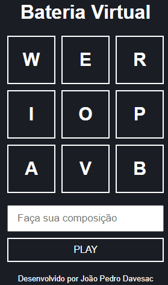

<h1 align="center">
    
</h1>

 Acesse a demonstração: https://jpdavesac.github.io/bateria_virtual/

<h1 align="center">
    Projeto Bateria Virtual
</h1>   

# 👉 Índice 
- [Sobre](#-sobre)
- [Tecnologias Utilizadas](#-tecnologias-utilizadas)

## 🔎 Sobre

O projeto **Bateria Virtual** foi feito durante o desafio dos 7 projetos em 7 dias da **B7Web**. O projeto é bastante simples, tem-se nove letras, cada uma toca um som diferente de uma bateria. Outra funcionalidade está na caixa de input abaixo do tabuleiro de teclas. Nela podem ser feitas pré-composições que são tocadas logo após se apertar o botão de **PLAY**.

## 🧠 Tecnologias Utilizadas

- HTML
- CSS
- Javascript

### Feito por **João Pedro Davesac** 

 E-mail: jpdavesac123@gmail.com 

 Linkedin:  https://www.linkedin.com/in/jo%C3%A3o-pedro-davesac-a4862b212/ 

